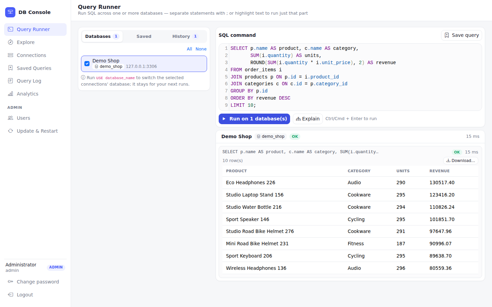
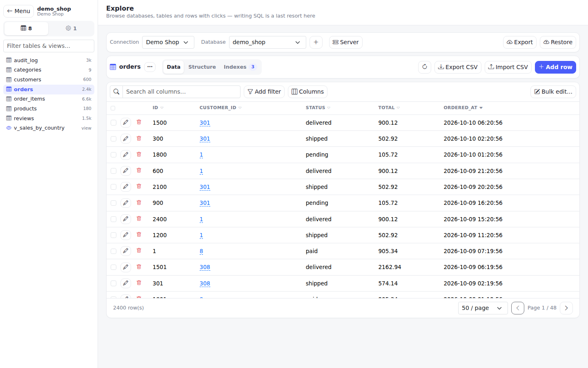
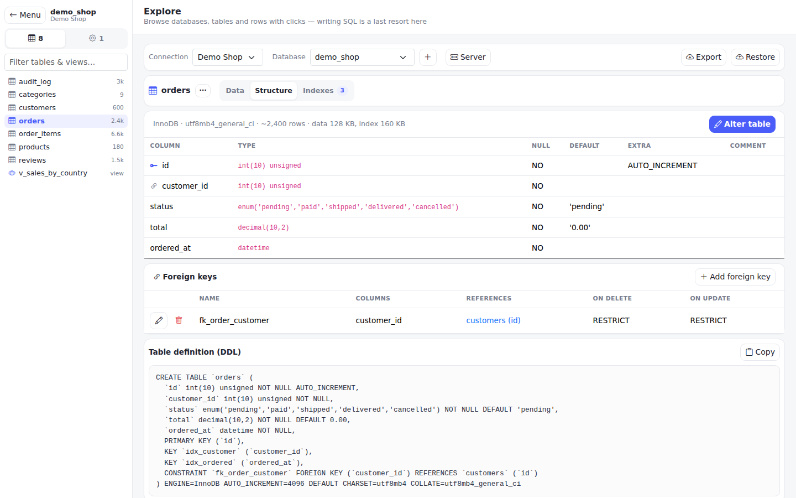
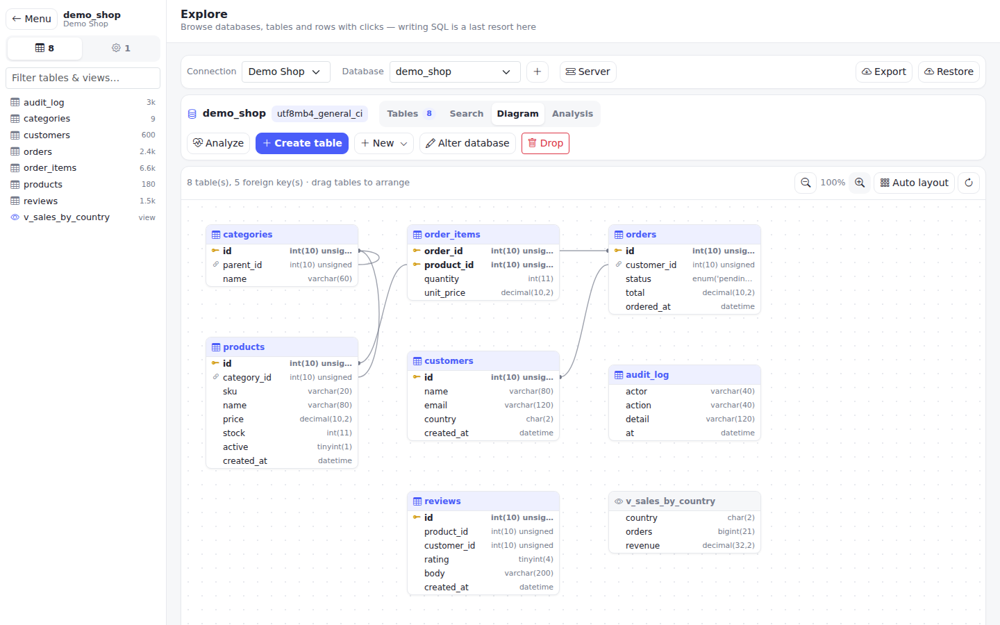
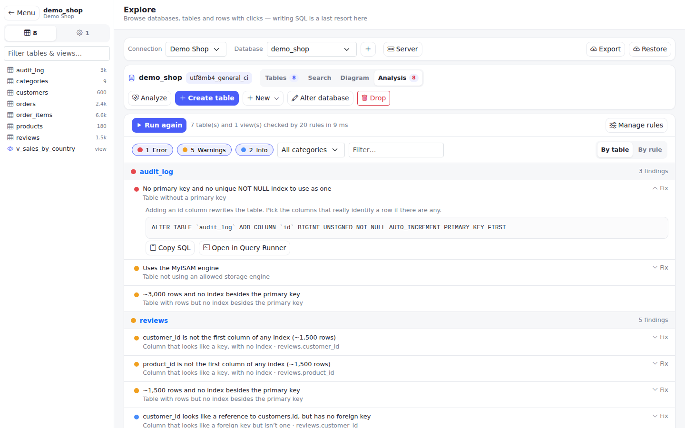
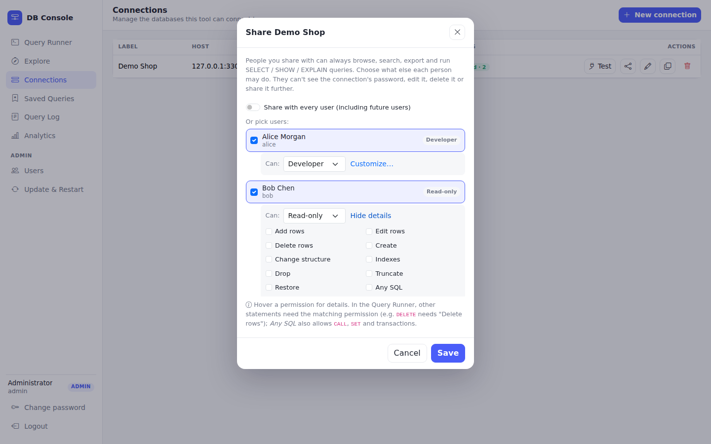
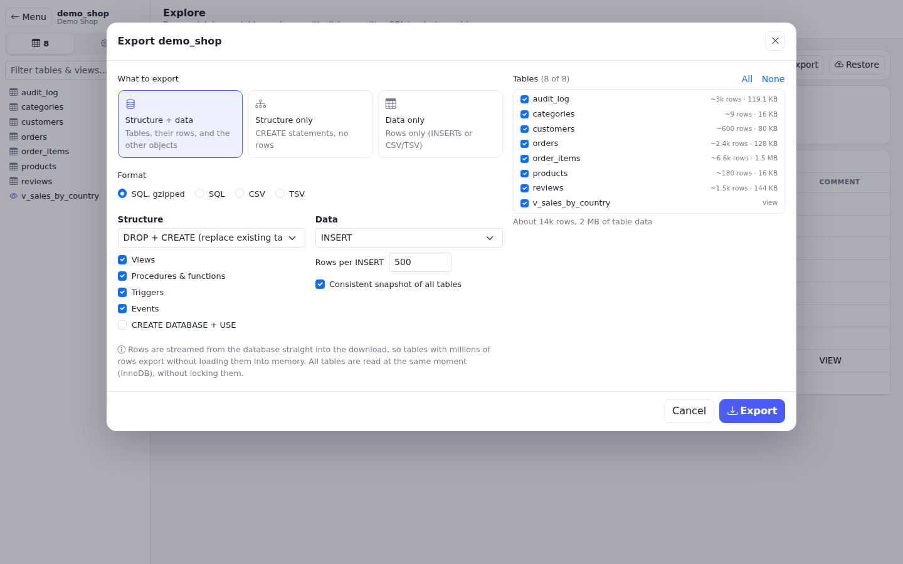
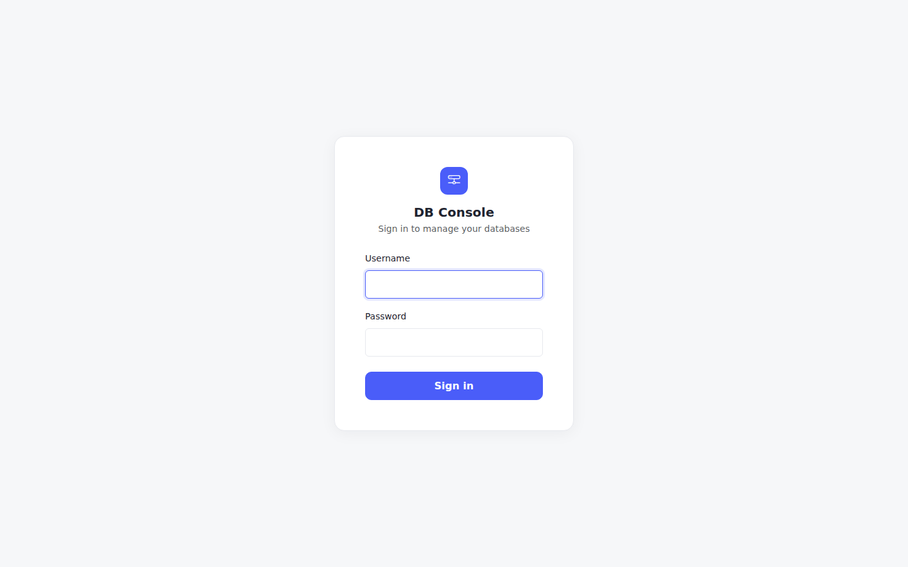

# DB Console

> **A small, portable database console that you can deploy almost anywhere.**

DB Console is a small, self-hosted SQL administration tool designed for environments where you need **simple database access without installing a large database management platform**.

It provides an easy-to-use web interface for exploring databases, viewing and editing tables, running SQL queries across multiple database connections, importing/exporting CSV files, and creating database backups.

It is especially useful for **client environments, small servers, support teams, development environments, field deployments, and troubleshooting scenarios** where a portable database console is more practical than a full-featured administration platform.



*The Query Runner: run SQL against one or several connections, with highlighting and autocomplete. [More screenshots below](#screenshots).*

---

## Why DB Console?

Database administration tools are often either:

* Too large for a small deployment
* Dependent on a separate database or infrastructure
* Difficult to deploy inside a customer's environment
* Focused primarily on developers rather than support/operations teams
* Not convenient when you need a temporary, portable administration interface

DB Console takes a different approach:

**Download → Configure → Run → Connect to Database**

No separate database is required for DB Console itself.

The application stores its configuration in simple JSON files and can run as a single Node.js application.

### Typical use cases

* Deploy a database console on a customer's server
* Troubleshoot client databases remotely
* Provide a lightweight alternative to Adminer/phpMyAdmin
* Manage multiple Database environments from one interface
* Inspect production databases during support
* Run the same SQL against multiple databases
* Import/export CSV data
* Create and restore database backups
* Package the tool with an application or solution deployment
* Run as a temporary diagnostic/support utility

---

## Screenshots

Taken from a demo shop database (MariaDB) — nothing here is real data.

| | |
|---|---|
| <br>**Explore** — browse, sort, filter and edit table data with clicks | <br>**Structure** — columns, keys, foreign keys and the table DDL |
| <br>**Diagram** — tables and their foreign keys, draggable | <br>**Analysis** — missing primary keys and indexes, and other anomalies, with the SQL to fix them |
| <br>**Sharing** — give each person exactly the permissions they need | <br>**Export** — structure, data or both, as SQL, CSV or TSV; built for large databases |

<p align="center"></p>

---

## Features

### 🗄️ Database Explorer

Browse Database servers through a structured interface.

When a database is open, the left menu slides away and is replaced by a full-height, compact list of its tables & views (plus routines, triggers and events), so the data grid gets the full width. **← Menu** brings the menu back; **Tables** shows the list again.

**Databases**

* Browse all databases on a connection
* Create, alter (collation, rename) and drop databases — renaming moves every table and is refused when the database has views, routines, triggers or events
* Overview of every table: engine, approximate rows, data and index size, auto-increment, collation and comment
* Bulk table actions: optimize, analyze, check, repair, truncate, drop, copy and move to another database. Drop and truncate always ask for confirmation first
* **Links that open the same place.** The address bar follows the UI: `#/explore/<connection>/<database>/table/<table>?view=structure`, `#/explore/<connection>/server?tab=variables`, `#/runner?c=<connections>`, `#/queries`, `#/logs`… Copy a link, duplicate a tab, press Back or reload and the same page opens. If the person doesn't have access to the connection, they're told so instead; if they're signed out, the link survives the login
* Search a value across every table of a database
* **Diagram** tab: every table with its columns, primary and foreign keys, joined by a line per foreign key. Drag tables to arrange them, zoom, or auto-layout; the layout is remembered per connection and database. Double-click a table to open it

**Analysis** — **Analyze** (or the **Analysis** tab) checks the database against a set of rules and lists what looks wrong, grouped by table or by rule and filterable by severity (error / warning / info), category and text. Nothing is changed; findings that have an obvious remedy show the SQL for it, with **Copy SQL** and **Open in Query Runner**. Anyone with access to the connection can run it. The built-in rules cover:

* **Indexes:** tables without a primary key (and a unique NOT NULL index that could become one); large tables with no index besides the primary key; `*_id` columns with no index; foreign keys without a usable index; duplicate and redundant indexes; too many indexes; indexes on columns with very few distinct values (off by default)
* **Design:** auto-increment columns close to their maximum; foreign keys between columns of different type or character set; non-InnoDB tables; money in `FLOAT`/`DOUBLE`; legacy character sets (`latin1`, 3-byte `utf8`); collations that differ from the database default; columns that look like foreign keys but aren't; very wide tables
* **Storage:** very large tables; indexes much larger than the data; free space inside tables (`OPTIMIZE TABLE`); empty and long-unmodified tables (off by default)
* **Objects:** views that no longer work (`CHECK TABLE`); disabled events
* **Security:** possibly sensitive column names such as `password` or `token` (off by default)
* **Runtime:** transactions open for a long time; statements waiting for a lock (with the blocking connection); deadlocks in the last N hours; replication lag or a stopped replica thread; tables over a size limit; indexes never used since the server started (needs `performance_schema` and a few days of uptime — otherwise the rule says why it could not run)

**Dismiss** (the eye icon on a finding; owner/admin) hides a finding you have decided is fine, with a reason. It leaves the list, the counts and scheduled analyses, shows under "dismissed" with who and why, and **Restore** brings it back. **Apply…** runs a finding's suggested fix after showing the exact SQL and a confirmation. The SQL always comes from a fresh analysis on the server (never from the browser), runs with *your* permissions on that connection (a read-only share can preview but not apply) and is written to the query log. Dismissals are stored in `data/analyzer_dismissed.json`.

**Rules are managed by admins** (**Manage rules**; everyone else can view them): switch any rule off, change its severity and thresholds (e.g. "at least 1,000 rows"), and set a regex of table names to ignore. Admins can also add their own rules, which can be tried against the open database before saving:

* **SQL rule:** one read-only `SELECT`; every row it returns is a finding. `@db` (or `DATABASE()`) is the database being analyzed; the optional columns `table`, `object`, `message`, `detail`, `fix` and `severity` fill in the finding. It runs in a `READ ONLY` transaction with a 10-second limit and returns at most 200 rows.
* **Naming / structure rule:** a regex for table, column or index names ("must match" / "must not match", optionally limited to column types), or "every table has a column matching…" (e.g. `created_at`).

Rule settings are stored in `data/analyzer_rules.json`. Open `#/explore/<connection>/<database>?tab=analysis` to share the analysis.

**Looking at data**

* **Related rows** (the ⛓ icon on every grid row): the rows this row points to through foreign keys, and for each table that points at it how many rows do, with one click to show exactly those rows
* **Column profile** (the chart icon on a column in **Structure**): rows, NULLs, distinct values, smallest / largest / average, lengths and empty strings, the ten most common values and a distribution chart. Tables of millions of rows are profiled on a sample, and the profile says so
* **Replace across the database** (**Search** tab → *Replace ‘…’ with…*): find text in every plain text column of every table, preview the affected rows and before/after samples, then replace it all in one transaction — any error leaves the data untouched. Case-sensitive; non-InnoDB tables (which cannot roll back) are never changed
* The row editor validates and formats **JSON** (Format / Compact) and has date, date-time and time pickers
* **Diagram** can be downloaded as **SVG** or **PNG**

**Compare** (the *Compare* tab of a database) — pick a source (the model, the open database by default) and a target (any database on any connection you can use):

* **Structure:** tables, columns, indexes, foreign keys, checks, table options, views, procedures, functions, triggers and events are compared, and every difference is a tick-box. The migration script that makes the target match the source is built from the ticked ones — view it, copy it, download it as `.sql`, open it in the Query Runner, or **Apply** it to the target (checked against your permissions on the target, statement by statement; the SQL is always rebuilt on the server). Things that would remove data (drops) start unticked. Renames show as drop + create; partitioning is reported but not scripted
* **Data:** compare two tables row by row (matched on the primary key or the key columns you give, optionally limited by a `WHERE`): identical / changed (with the columns that differ) / only in source / only in target, and a sync script. **Apply** inserts the missing rows, updates the changed ones and, only if you tick it, deletes the extra ones — in one transaction. Up to 500,000 rows per side; the script covers the first 5,000 differences of each kind

**Tables**

* **Data** tab: pagination, multi-column sorting (Shift+click a header to add a sort), search across all columns, and Adminer-style filters: column (or any column) + operator (`=`, `≠`, `<`, `>`, contains, starts/ends with, `LIKE`, `REGEXP`, `IN`, `IS NULL`...) + value, combined with AND; applied on the server, and used by CSV export too
* Choose which columns to show (remembered per table)
* Foreign-key values are links to the referenced row
* Double-click a cell to edit it in place; long, JSON and binary values open a cell viewer, and binary values can be downloaded
* Add, edit, clone and delete rows from the row's left-hand actions; delete always asks for confirmation. The row form knows each column's type, can set `NULL`, and can use a function (`NOW()`, `UUID()`, `MD5()`…) instead of a value
* Select rows and delete them in bulk
* **Bulk edit**: change one or more columns in the selected rows, or in every row matching the current search and filters — set a value, `NULL` or `DEFAULT`, use a function, add a number, find & replace, prepend or append text. The `UPDATE` is shown with the number of matching rows before it runs, and runs in one transaction
* Primary-key aware editing; tables without a primary key are read-only
* **Structure** tab: columns, foreign keys and the table DDL
* Create and alter tables: add, change, rename, reorder and drop columns, defaults (value, `NULL`, expression), auto-increment, engine, collation, comment and auto-increment value
* Add, edit and drop foreign keys (with `ON DELETE` / `ON UPDATE`)
* **Indexes** tab: list, create, edit and drop indexes (PRIMARY, UNIQUE, INDEX, FULLTEXT, SPATIAL; multiple columns, optional prefix lengths)

**Views, routines, triggers and events**

* View their definitions
* Create, edit and drop views, procedures, functions, triggers and events in a SQL editor that starts from a template. Editing runs `DROP` + `CREATE`; if the new definition fails, the original is put back. `DEFINER` clauses are left out, so objects are created as the connection's user

Every change to the schema shows the exact SQL before it runs, and is written to the query log.

**Server** (owner or admin of the connection)

* **Health** (the first tab): connections against the limit, running queries, queries per second, slow queries, InnoDB buffer-pool hit ratio, row-lock waits, temporary tables on disk and traffic; a plain-language **Worth a look** list (connection limit nearly reached, statements waiting for a lock, transactions left open, a stopped or lagging replica, a too-small buffer pool, slow query log off…); what is running and which transactions are open; the full `SHOW ENGINE INNODB STATUS`; and charts over time. The live chart fills while the page is open (refreshing every 5 s); **Record every minute** makes the server keep a few counters for that connection (`data/metrics/`, the newest 7 days) so the chart can show the last hour, 6 hours, 24 hours or 7 days even when nobody is looking
* Process list, with kill query / kill connection
* Server variables and status
* Database accounts: create, drop, change password, grant and revoke privileges (server-wide, per database or per table)

Views are identified separately; their rows are read-only.

---

### ⚡ SQL Query Runner

Run SQL directly against one or multiple database connections.

```text
Select databases
       ↓
Write SQL
       ↓
Execute
       ↓
┌───────────────┬───────────────┐
│ Database A    │ Database B    │
│ 125 rows      │ 125 rows      │
│ 12 ms         │ 18 ms         │
└───────────────┴───────────────┘
```

Features include:

* SQL editor with syntax highlighting and autocomplete for keywords, tables and columns (Ctrl+Space); Ctrl+Enter runs the selection or everything
* Execute SQL against multiple connections
* Parallel execution
* Per-database results
* Result rows
* Affected-row counts
* Error reporting, and the server's warnings for a statement that produced any
* **Stop** (shown while a run is executing) cancels the running statement with `KILL QUERY`; it only ever stops the statement that run started, never another user's query on a reused pooled connection. Works across PM2 cluster workers
* **Explain** (next to **Run**) shows the execution plan of SELECT / UPDATE / DELETE / INSERT statements without running them
* Asks for confirmation before running `DROP`, `TRUNCATE`, `DELETE`, or an `UPDATE` / `DELETE` without a `WHERE` anywhere in the batch (comments and text inside strings are ignored), and before a `SELECT` with no `LIMIT`
* Results are paged in the browser; at most 10,000 rows are shown per statement (with the real total) — it is only a preview
* **Download…** on a result saves **every row**, however many: the statement is run again on the server and streamed straight into a CSV or TSV file (optionally gzipped), so results of lakhs or millions of rows need no browser or server memory. If the query ends in a `LIMIT n` used as a preview, tick "Ignore the LIMIT" to get the whole result set; or stop after N rows, choose how `NULL` is written, and add a byte-order mark for Excel. It runs in a `READ ONLY` transaction, only for statements that return rows, and is written to the query log
* `CALL` shows the procedure's first result set
* **Query parameters.** Write `{{name}}` (or `{{name=default}}`) in the SQL and fill the values in the panel that appears. Values are sent to the server and become escaped literals — numbers stay numbers, `null` is NULL, anything else is quoted; inside a quoted string (`LIKE '%{{q}}%'`) the value is escaped but not quoted. A value can never add a statement. The query log and the results show the SQL that actually ran. Saved queries keep their placeholders
* **Format** tidies the SQL (the selection, or everything; placeholders survive) and **Snippets** inserts ready-made statements (joins, duplicates, table sizes, indexes, running queries, …)
* **Result tabs** — every run keeps its own tab (the last 10), so you can compare against an earlier result
* **Chart** on a result with numeric columns: bars, line, pie or doughnut, any column for the labels, one or more for the values (first 500 rows)
* **Compare results** when a run covered two or more connections: shows the rows that exist on only one side (and how many are identical), matching on the columns both results share. Limited to the rows the page holds (10,000 per statement)
* **History** keeps your last 300 runs (per user, in this browser) with search and an OK / error filter
* Saved SQL queries
* Load saved queries directly into Query Runner
* `USE database_name` switches a connection's current database; it is shown in the connection list and kept for your next runs (per user, in your browser) until you run `USE` again or click the reset button next to it

This is particularly useful when the same query needs to be executed against multiple customer, branch, tenant, or environment databases.

---

### 🔌 Connection Manager

Manage Database connections directly from the web interface.

* Add connections
* Edit connections
* Delete connections
* Test connections
* Clone an existing connection
* Store multiple database environments
* Connection-specific settings
* Passwords are never returned to the browser after being saved
* **TLS** per connection (encrypt, or encrypt and verify the server certificate, with an optional private CA and client certificate)
* **SSH tunnel** per connection, for databases reachable only through a bastion host: password or private-key login (with passphrase), optional host-key fingerprint pinning (`SHA256:…`, as `ssh-keygen -lf` prints it). The database host/port in the form are then resolved from the SSH server. Uploads, exports and streaming downloads use the tunnel too. SSH passwords, keys and the TLS client key are stored encrypted
* Every connection has an owner
* Share a connection with specific users, or with everyone
* Shared users can use a connection but cannot see its password, edit, delete or re-share it
* **Per-user permissions.** Everyone a connection is shared with can always browse, search, view the diagram, export and run `SELECT` / `SHOW` / `DESCRIBE` / `EXPLAIN` / `USE`. For each person (or for "everyone") the owner chooses what else they may do, with presets (**Read-only**, **Data editor**, **Developer**, **Full access**) or tick-boxes:

  | Permission | Allows |
  |---|---|
  | Add rows | add rows, import CSV/TSV |
  | Edit rows | edit rows in the grid, bulk edit |
  | Delete rows | delete rows |
  | Create | create tables, views, procedures, functions, triggers, events and databases; copy tables |
  | Change structure | alter tables (columns, foreign keys), rename, alter databases, optimize/repair |
  | Indexes | create, change and drop indexes |
  | Drop | drop tables, views, routines, triggers, events and databases |
  | Truncate | `TRUNCATE` tables |
  | Restore | restore a backup / SQL file |
  | Any SQL | other Query Runner statements: `CALL`, `SET`, transactions… |

  The server enforces them on every Explore route and on each statement in the Query Runner (a batch is refused as a whole before anything runs; `DELETE` needs *Delete rows*, `DROP` needs *Drop*, `CREATE INDEX` needs *Indexes*, and so on). Controls a user can't use are hidden. Statements that only read run in a `READ ONLY` transaction, so a stored function that writes fails for them. The owner and admins can always do everything.

* **Limit a share to some databases and hide tables.** In the share dialog each person (or "everyone") can be restricted to a list of databases and have tables hidden (`users`, or `shop.payments`). Hidden tables disappear from the table list, the diagram, autocomplete and search, their pages and definitions answer "not found", and the Query Runner, downloads, compare and schedules refuse SQL that names a database or table outside the limit (case and backticks make no difference; `SHOW DATABASES` and the system schemas are off). Full-database export / restore, analysis, search & replace and structure compare are switched off while tables are hidden, because they read everything. **This is an application-level guard, not a replacement for database grants:** stored routines, views and dynamic SQL can still reach more than the SQL text names, so also give the connection's database account only the privileges it should have
* **Approvals for risky statements.** Switch on *Ask me before they run risky statements* in the share dialog. Then when someone the connection is shared with runs `DROP`, `TRUNCATE`, or an `UPDATE` / `DELETE` without a `WHERE` in the Query Runner, nothing runs: it becomes a request (shown under **Approvals**, with a badge for the owner and for admins, and sent to the webhook / the *approval e-mails* in Alert settings). The owner or an admin — never the requester — approves it (it then runs immediately with the *requester's* permissions, and is logged under the requester's name) or rejects it with a reason; the requester can withdraw it. Requests expire after 7 days. Owners and admins are never held back

Example:

```text
Connections

├── Production
├── UAT
├── Development
├── Customer A
├── Customer B
└── Customer C
```

---

### 📊 Export

**Export** (Explore → database) lets you choose:

* **What:** structure + data, structure only, or data only
* **Format:** SQL, gzipped SQL, CSV or TSV (several tables as CSV/TSV come as a `.tar.gz` with one file per table)
* **Tables** (with their approximate row counts and sizes)
* **Structure:** `DROP` + `CREATE`, `CREATE`, or `CREATE IF NOT EXISTS`; views, procedures and functions, triggers, events; optionally `CREATE DATABASE` + `USE`
* **Data:** `INSERT`, `INSERT IGNORE`, `INSERT … ON DUPLICATE KEY UPDATE` or `REPLACE`; rows per `INSERT`; `TRUNCATE` before the rows (data only)
* **Consistent snapshot:** all tables are read in one transaction (like `mysqldump --single-transaction`), so a busy database is dumped as it was at one moment, without locking it (InnoDB)

Exports are built for large databases:

* Rows are **streamed** from the database straight into the download (and through gzip), with backpressure: a slow download pauses the query instead of filling memory. A million-row table exports with the server using roughly 50 MB more memory than when idle.
* Each `INSERT` is also capped at about 1 MB, so rows with large values never produce a statement bigger than the restoring server's `max_allowed_packet`.
* Like `mysqldump`, SQL dumps set `FOREIGN_KEY_CHECKS=0`, `UNIQUE_CHECKS=0`, `SQL_MODE=NO_AUTO_VALUE_ON_ZERO` (a row with id 0 keeps it) and `TIME_ZONE='+00:00'` (`TIMESTAMP` values restore unchanged on a server in another time zone), and put the previous values back at the end.
* Routines, triggers and events are written in `DELIMITER ;;` blocks, triggers after the data, `DEFINER` clauses removed, generated columns left out of the `INSERT`s. JSON is written exactly as stored.
* Multi-table CSV/TSV exports start downloading at once; each table goes through a temporary file (tar needs its size up front) that is deleted as soon as it's in the archive.
* Cancelling a download stops the query on the database server.
* File names say what's inside and when: `shop-20260105-0930.sql.gz`, `shop-schema-….sql`, `shop-data-….sql`.

CSV/TSV: `NULL` is written as `\N` (the MySQL `LOAD DATA` convention; a real `\N` text is quoted), binary values as Base64, JSON as JSON text. The table's **Data** tab also exports the rows matching its current search and filters as CSV.

---

### 📥 Import (CSV / TSV / Excel / JSON)

Besides CSV and TSV you can import **Excel** files (`.xlsx`, `.xls`, `.ods`; pick the sheet; dates become real dates, empty cells NULL) and **JSON** (an array of objects, or one object per line; the keys become the columns, nested values are kept as JSON text). Those are converted to CSV in your browser (keep them under about 50 MB; the SheetJS library is loaded only when you choose such a file) and then go through the same mapping and streaming import as a CSV. SQL `INSERT` files are restored with **Restore**.

Import a CSV or TSV file — also gzipped (`.csv.gz`) — into an existing table:

1. Pick the file; the first row must be a header. The format and delimiter (`,` `;` tab `|`) are detected, and the first rows are shown
2. Map each file column to a table column (matched by name automatically), or skip it
3. Choose:
   * **When a key already exists:** error, skip the row (`INSERT IGNORE`), update the row (`ON DUPLICATE KEY UPDATE`) or replace it
   * **When a row fails:** stop and report its line number, or skip it (the skipped rows and their errors are listed) and continue
   * **All or nothing** (default): the whole import is one transaction — if it fails or is stopped, nothing is kept. Otherwise rows are committed every 10,000
   * Empty the table first (inside the transaction when "all or nothing" is on, so it's undone on failure); don't check foreign keys; binary columns hold Base64
4. Watch the progress bar (percent, rows per second, time left), and stop it at any time

The file is **uploaded as a stream and parsed on the server as it arrives**, then inserted in multi-row batches sized to the server's `max_allowed_packet`. Neither the browser nor the server holds the file in memory, and the upload only goes as fast as the database inserts it. Tested with a 120 MB, 1,000,000-row file (≈ 30 s, ≈ 50 MB extra server memory).

When a batch fails, it is rolled back to a savepoint and retried row by row, so the error names the exact line (`Line 1234: Data too long for column 'country'`). MySQL warnings (e.g. values truncated under `INSERT IGNORE`) are counted and the first ones shown.

CSV follows RFC 4180 (quoted fields, `""`, newlines inside quotes). TSV is MySQL-style (backslash escapes, as written by `SELECT … INTO OUTFILE` and by DB Console). An unquoted `\N` is `NULL`; an empty value is `NULL` for nullable non-text columns (numbers, dates…). Files exported by DB Console import back **exactly** (verified with `CHECKSUM TABLE` on a million rows with NULLs, empty strings, quotes, newlines, tabs, JSON, binary data, emoji and `TIMESTAMP`s).

---

### 💾 Restore

Restore `.sql`, `.sql.gz` or `.tar.gz` files — including dumps made by `mysqldump`:

* The file is streamed and run statement by statement as it uploads; large dumps never sit in memory
* The SQL splitter understands `DELIMITER`, comments, quoted strings and escapes, so procedures, functions, triggers and events restore too
* **If a statement fails:** stop there (default), or continue and list the errors
* Foreign key checks can be turned off for the restore, so tables load in any order
* Statements run with autocommit off and are committed every 200 statements or 2 seconds — much faster than one commit per `INSERT`
* A progress bar shows how much of the file has been processed; **Stop** ends it (what already ran stays applied)

The older **backup** endpoint still produces a `database-backup.tar.gz` (tables, data and views) using only Node.js built-ins.

---

### 🔖 Saved Queries

Save frequently used SQL commands.

```text
Saved Queries

├── Find duplicate customers
├── Check pending transactions
├── Daily collection summary
├── Find failed jobs
└── Database health check
```

Saved queries can be:

* Created — from the editor, or from any entry in the Query Runner's **History** tab
* Edited
* Deleted
* Loaded directly into Query Runner
* Shared with specific users, or with everyone

Saved queries belong to the user who saved them. Shared queries appear in the other users' Saved Queries; they can load them or save their own copy, but only the owner can edit, delete or re-share them. Running a shared query still requires access to a connection.

---

### 👥 Users & Roles

DB Console supports multiple users, each with their own login.

| Role      | Can do                                                                                                   |
| --------- | -------------------------------------------------------------------------------------------------------- |
| **admin** | Everything: all connections, every user's query log and analytics, user management, Update & Restart    |
| **user**  | Their own connections plus connections shared with them; only their own query log and analytics         |

* Passwords are stored as salted `scrypt` hashes
* Admins create, edit, disable and delete users
* Each user can change their own password
* **Single sign-on (OpenID Connect)** — Google, Microsoft Entra ID, Okta, Auth0, Keycloak… Set `OIDC_ISSUER`, `OIDC_CLIENT_ID` and `OIDC_CLIENT_SECRET` (or an `oidc: {…}` block in `config.js`) and register `https://<your server>/auth/oidc/callback` as the redirect URI at the provider; the login page then shows a **Sign in with …** button. It uses the authorization-code flow with PKCE and verifies the ID token's RS256 signature, issuer, audience, expiry and nonce. `OIDC_ALLOWED_DOMAINS` (e-mail domains that may sign in), `OIDC_ADMIN_EMAILS` (become admins when first created), `OIDC_AUTO_CREATE=false` (stop accepting new people once everyone has signed in once), `OIDC_DEFAULT_ROLE`, `OIDC_LABEL`, `OIDC_SCOPES` and `OIDC_REDIRECT_URI` fine-tune it. The provider must vouch for the e-mail address (`email_verified`). SSO users have no password here; the provider's own MFA applies
* **Directory sign-in (LDAP / Active Directory)** — set `LDAP_URL` (`ldap://` or `ldaps://`) and `LDAP_BASE_DN`, plus a read-only service account (`LDAP_BIND_DN`, `LDAP_BIND_PASSWORD`) if the directory does not allow anonymous search. Users type their directory username and password on the normal login form; the server looks the user up (`LDAP_USER_FILTER`, default `(|(uid={username})(sAMAccountName={username})(mail={username}))`, with the name escaped) and then binds as that user — an empty password is never sent. An account is created on first sign-in; `LDAP_ADMIN_GROUP` (a group DN, matched by `memberOf` or by `member`/`uniqueMember` on the group) makes its members admins. Local accounts always use their local password and are never handed to the directory. `LDAP_STARTTLS`, `LDAP_REJECT_UNAUTHORIZED=false` (for a private CA you have not installed), `LDAP_AUTO_CREATE`, `LDAP_DEFAULT_ROLE`, `LDAP_NAME_ATTR`, `LDAP_MAIL_ATTR`, `LDAP_USERNAME_ATTR` and `LDAP_LABEL` are also available
* **Two-factor authentication** (TOTP — Google Authenticator, Microsoft Authenticator, Authy, 1Password…): each user turns it on under *Two-factor auth* in the sidebar by scanning a QR code and confirming a code; sign-in then asks for the 6-digit code after the password. Ten one-time **recovery codes** are shown once (new ones can be generated; each works once). A code works only once; wrong codes count towards the sign-in lockout; the secret is stored encrypted. An admin can turn 2FA off for someone who lost both phone and codes (*Users* → shield icon). Set `REQUIRE_2FA=1` (or `require2fa: true` in `config.js`) to make it mandatory: users without it can only set it up until they have
* Changing a user's password, role or status signs that user out everywhere
* Deleting a user transfers their connections and saved queries to the admin who deleted them
* The app always keeps at least one enabled admin

---

### 🎨 Comfort

* **Dark mode** — *Theme* in the sidebar cycles *system* → *light* → *dark* (the choice is remembered per browser; *system* follows your OS setting, including the SQL editor and the charts)
* **Phone and tablet layout** — below 768 px the sidebar becomes a drawer (the menu button in the top bar; it closes when you pick something), dialogs slide up from the bottom, and tables scroll sideways inside their card
* **Keyboard shortcuts** (press `?`): `Ctrl/Cmd+K` jump to any page, connection or table · `Ctrl+Enter` run · `Ctrl+Shift+F` format · `Ctrl+S` save the SQL as a query · `Ctrl+/` comment lines · `Esc` close the open dialog · `/` focus the search box · `g` then `r` / `e` / `c` / `q` / `l` / `s` / `a` go to Runner / Explore / Connections / Saved queries / Log / Schedules / Approvals

---

### ⏰ Schedules

Run things on a timetable and get told when something is wrong (**Schedules** in the sidebar).

* **Query** — run a SQL statement (with `{{parameters}}`) and keep the rows as a CSV (the newest N files), optionally attached to an email. Alert when it fails, every run, when it returns rows, or when it returns none (a classic "this should never happen" check). Runs with its owner's permissions, and every run is in the query log
* **Analysis** — analyse a database and track the findings over time: a trend chart of errors and warnings, and an alert when there are errors or more problems than last time
* **Backup** — dump a database to `.sql.gz` under `data/backups/`, keep the newest N, and optionally **test-restore** each one into a scratch database (tables and row counts are checked, then the scratch database is dropped). Backups can be uploaded to **S3** (or any S3-compatible service: MinIO, Wasabi, R2…) and to **SFTP**; on SFTP only the newest N are kept (for S3 use a bucket lifecycle rule)
* **Connection check** — ping connections and alert when one **goes down** or **comes back** (not on every check while it stays down)
* Schedules are cron expressions (`*/15 * * * *`, `0 2 * * 1-5`, `@daily`…) or presets, in the server's local time (set `TZ` to change it); a job can also be **manual only** and started with **Run now**
* Alerts go to **email** (SMTP) and/or a **webhook** (Slack, Teams, Discord or your own endpoint; an optional signing secret adds an `X-DBConsole-Signature: sha256=…` header). Admins configure both under **Schedules → Alert settings**; SMTP password and webhook secret are stored encrypted
* Under PM2 cluster mode one worker is elected to run the timetable (another takes over within 30 seconds if it dies), and a job never runs twice at once. A run that was missed while the server was down runs once when it comes back
* Everyone manages their own jobs; admins see all. Backups need owner or admin rights on the connection

---

### 📜 Query Log

Everything run against a database is logged per user:

* Query Runner runs (one entry per connection)
* Row inserts, edits and deletes from Explore
* CSV imports and exports
* Backups and restores
* Update & Restart actions

Each entry records the user, time, connection, database, SQL, statement type, duration, rows returned or affected, and any error.

The log can be filtered by user, connection, source, statement type, status, date range and free text, and any Query Runner entry can be loaded back into the runner.

Users see their own entries; admins see everyone's.

---

### 📈 Analytics

Usage over the last 7, 30 or 90 days:

* Total queries, error rate, average duration, active users
* Queries per day
* Breakdown by user, connection, statement type and source
* Slowest queries

Admins can view all users or a single user; users see their own activity.

---

### 🔄 Update & Restart (admin)

Keep a deployment up to date from the browser:

* Shows the running branch, commit, local changes, PM2 process and uptime
* **Check for updates** fetches from git and lists incoming commits
* **Update & restart** runs `git pull --ff-only`, runs `npm install --omit=dev` only when `package.json` / `package-lock.json` changed, then restarts through PM2 (`pm2 reload` in cluster mode, `pm2 restart` otherwise)
* **Restart only** restarts the PM2 process without updating
* In cluster mode every instance is listed (PID, status, uptime, restarts, memory), and the restart is a rolling `pm2 reload` of all instances, one at a time
* Only one update can run at a time, across all instances

Requirements:

* The app directory is a git clone with an upstream branch configured
* The app runs under PM2 (see [Running with PM2](#running-with-pm2)) — without PM2 the update still pulls the code, but you restart manually
* The OS user running the app can run `git`, `npm` and `pm2`, and `git pull` works without prompting for credentials

Users stay signed in across updates and restarts (sessions are stored in the data directory).

---

## Lightweight by Design

DB Console deliberately keeps its architecture simple.

```text
             ┌─────────────────────┐
             │      Browser        │
             │ Bootstrap + Alpine  │
             └──────────┬──────────┘
                        │ HTTP
                        ▼
             ┌─────────────────────┐
             │    DB Console       │
             │ Node.js + Express   │
             └──────────┬──────────┘
                        │
               ┌────────┴────────┐
               │                 │
               ▼                 ▼
        JSON Configuration     Database
        connections.json      Databases
        queries.json
```

There is **no database required for DB Console itself**.

### Technology Stack

| Layer                 | Technology       |
| --------------------- | ---------------- |
| Runtime               | Node.js          |
| Backend               | Express          |
| Database Driver       | Database2           |
| Connection Pooling    | Database2 Pool      |
| Session               | express-session  |
| Frontend              | HTML + Alpine.js |
| UI                    | Bootstrap 5      |
| Icons                 | Bootstrap Icons  |
| CSV                   | PapaParse        |
| Configuration Storage | JSON             |
| Backup Compression    | Node.js zlib     |

There is also **no frontend build system required**.

---

# Quick Start

## Requirements

* Node.js 18+
* Database 5.7+ / Database 8+
* Network access to the Database server

Check Node.js:

```bash
node --version
```

---

## Installation

Clone the repository:

```bash
git clone https://github.com/<your-org>/db-console.git
cd db-console
```

Install dependencies:

```bash
npm install
```

Start the server:

```bash
node server.js
```

Open:

```text
http://localhost:3000
```

Log in using the credentials configured in `config.js`.

On first start the app creates its `data/` directory (connections, saved queries, users, sessions, query log). Nothing in it is part of the repository.

---

## Running with Docker

```bash
export SESSION_SECRET=$(openssl rand -hex 32)
export DBC_ENCRYPTION_KEY='a long passphrase you keep safe'
docker compose up -d          # http://localhost:3000, admin / admin123! (change it)
```

or without compose:

```bash
docker build -t db-console .
docker run -d -p 3000:3000 -v dbc-data:/data \
  -e SESSION_SECRET=... -e DBC_ENCRYPTION_KEY=... db-console
```

* `/data` (connections, users, sessions, logs) must be a volume.
* Settings are the environment variables from [Other settings](#other-settings); `APP_USER` / `APP_PASS` create the first admin on first start. To seed a connection on first start use `DB1_HOST`, `DB1_PORT`, `DB1_USER`, `DB1_PASSWORD`, `DB1_NAME` (`config_sample.js`), or add connections in the UI.
* The container reaches databases on the Docker host as `host.docker.internal` (add `extra_hosts: ["host.docker.internal:host-gateway"]` on Linux), not `localhost`.
* The image runs as the unprivileged `node` user and has a `HEALTHCHECK` on **`GET /health`**, which needs no sign-in and returns `200 {"status":"ok"}` (or `503` if the data directory isn't writable). Use it for load balancers and uptime monitors too; it stays reachable when `ALLOWED_IPS` is set.
* The Dockerfile was checked by installing and starting exactly the files it copies; if a `docker build` fails for you, please open an issue.

## Running with PM2

```bash
npm install -g pm2
cp ecosystem_copy.config.js ecosystem.config.js   # adjust as needed
pm2 start ecosystem.config.js
pm2 save
```

**Cluster mode** (`exec_mode: "cluster"`) works with any number of instances (`instances: 2`, `4`, `'max'`...):

* Sessions are stored in the data directory, so any instance can serve any request, and restarts don't sign users out
* Data files are written atomically under a cross-process lock, so concurrent changes from different instances are never lost
* Login rate limiting and the "update running" lock are shared by all instances
* **Update & Restart** reloads every instance one at a time (`pm2 reload <name>`); `wait_ready` + `listen_timeout` in the ecosystem file make PM2 wait until each new instance is listening before stopping the old one

All instances must share the same data directory (the default `./data` does).

---

## Upgrading an existing installation

Older versions kept `data/connections.json` and `data/queries.json` in git. They are no longer tracked, so a plain `git pull` on a server that has changed them stops with *"Your local changes would be overwritten"*. Upgrade once with:

```bash
cp -a data /tmp/db-console-data-backup     # keep your connections and queries
git checkout -- data                        # drop the tracked copies' local changes
git pull
cp -a /tmp/db-console-data-backup/. data/   # put your data back (now ignored by git)
pm2 reload ecosystem.config.js              # or restart however you run it
```

On first start after the upgrade, existing connections and saved queries are assigned to the first admin, and the login from `config.js` becomes that admin.

---

# Configuration

DB Console can be configured using `config.js` or environment variables.

### Authentication

```text
APP_USER
APP_PASS
SESSION_SECRET
```

Example:

```javascript
module.exports = {
    appAuth: {
        username: "admin",
        password: "change-me"
    },
    sessionSecret: "replace-with-a-long-random-secret"
};
```

`appAuth` is only used the **first time** the app starts, to create the first admin account in `data/users.json`. After that, users and passwords are managed from the **Users** screen, and changing `appAuth` has no effect.

If you lose access to every admin account, stop the app, delete `data/users.json` and start it again: the admin from `appAuth` is recreated.

Connections and saved queries created before multi-user support are assigned to that first admin automatically.

### Other settings

| Setting (env / `config.js`) | Default  | Purpose |
| --------------------------- | -------- | ------- |
| `PORT`                      | `3000`   | HTTP port |
| `DATA_DIR` / `dataDir`      | `./data` | Where connections, users, sessions and the query log are stored |
| `TRUST_PROXY` / `trustProxy`| off      | Set to `1` behind a reverse proxy, so client IPs (rate limiting) and HTTPS (secure cookies) are detected from `X-Forwarded-*` |
| `DBC_ENCRYPTION_KEY` / `encryptionKey` | generated | Passphrase for encrypting saved connection secrets (see below). Without it a key file `data/.secret.key` is created |
| `ALLOWED_IPS` / `allowedIps` | off     | Only these addresses / CIDR ranges may reach the app (comma-separated, or an array in `config.js`); everyone else gets 403. `/health` stays open |
| `SESSION_MINUTES` / `sessionMinutes` | `240` | Longest a sign-in lasts |
| `IDLE_MINUTES` / `idleMinutes` | off   | Sign out after this many minutes without activity |

### Database Connections

Initial database connections can optionally be provided as seed data.

For example:

```javascript
databases: [
    {
        key: "production",
        name: "Production",
        host: "127.0.0.1",
        port: 3306,
        user: "dbuser",
        password: "password"
    }
]
```

Seed data is used only when the application creates its initial connection configuration.

After that, connections can be managed through the **Connections** interface.

---

# Data Storage

DB Console does not require a database for its own configuration.

By default:

```text
data/
├── connections.json     # connections, with owner and sharing
├── queries.json         # saved queries, per user
├── users.json           # users and password hashes
├── query_log.jsonl      # query log, one JSON entry per line
├── sessions/            # one file per signed-in session
└── login_attempts.json  # failed-login counters for rate limiting
```

are used for persistent application data.

* Everything is **created automatically** on first start, and recreated if deleted; the whole directory is ignored by git
* Files are readable by the app's OS user only (`0600`) — they contain database passwords and password hashes
* Writes are atomic and locked, so several PM2 cluster instances can share the directory
* The query log rotates at 20 MB to `query_log.1.jsonl`; one previous file is kept
* The location can be changed with `DATA_DIR`

To back up DB Console itself, back up this directory.

This makes the application easy to:

* Copy
* Backup
* Move
* Deploy
* Package
* Run on small servers

---

# API

All API endpoints require an authenticated session except:

```text
POST /api/login
```

## Authentication

```http
POST /api/login
POST /api/logout
GET  /api/session
POST /api/account/password
```

---

## Users

```http
GET    /api/users/directory       # any user: active users, for sharing
GET    /api/users                 # admin
POST   /api/users                 # admin
PUT    /api/users/:username       # admin
DELETE /api/users/:username       # admin
```

---

## Connections

```http
GET    /api/connections
POST   /api/connections
PUT    /api/connections/:key
DELETE /api/connections/:key

POST /api/connections/:key/test
POST /api/connections/test

PUT  /api/connections/:key/sharing    # { "sharedWith": ["alice"] or ["*"], "permissions": { "alice": ["insert", "update"] } }
GET  /api/permissions                 # the permission names, labels and presets
```

Only the owner or an admin can edit, delete or share a connection.

---

## PostgreSQL and SQLite

Besides MySQL / MariaDB, a connection can point at a **PostgreSQL** server or a **SQLite** file. Choose the type when you create the connection.

- **PostgreSQL**: host, port (5432), user, password and database as usual. TLS and the SSH tunnel work the same way as for MySQL. Schemas appear where MySQL has databases (system schemas are hidden).
- **SQLite**: the path of a file on the machine DB Console runs on. Only administrators may create or change these (the path is a file on the server). *Create it if missing* creates an empty file; *Open read-only* refuses every write.

What works on both: the connection test, Explore (tables, views, triggers and routines, structure, indexes, foreign keys, the diagram, browsing with sorting, paging, filters and search, adding, editing and deleting rows), the Query Runner (multi-statement scripts, Explain, parameters, history, charts, Stop), query and table downloads, saved queries, sharing, per-connection permissions (read-only shares), the query log, and scheduled **query** and **connection check** jobs.

Not available yet for these connections (the page says so instead of failing): creating or altering tables, databases, indexes and foreign keys, Import, bulk edit, Backup / Restore, Analysis, Search and replace, Compare, the Server tools, scheduled analysis and backup jobs, and database-level access restrictions in the Query Runner (those users can still use Explore).

Notes: Stop on SQLite abandons the running statement (a statement inside SQLite's own code cannot be interrupted from Node), so a runaway query may keep a CPU busy until it ends; the connection itself is usable again at once. Big integers and `bytea` / `BLOB` values are shown exactly (as text and hex). The test suite runs the PostgreSQL tests only when a server is reachable (`TEST_PG_HOST`, `TEST_PG_PORT`, `TEST_PG_USER`, `TEST_PG_PASS`, `TEST_PG_DB`, default `127.0.0.1:5432`, `dbc` / `dbcpass`, database `dbc_pg`).

## Saved Queries

```http
GET    /api/queries                # yours + shared with you
POST   /api/queries
PUT    /api/queries/:id            # owner only
DELETE /api/queries/:id            # owner only
PUT    /api/queries/:id/sharing    # owner only: { "sharedWith": ["alice"] } or ["*"]
```

---

## Database Explorer

List databases:

```http
GET /api/explore/:key/databases
```

List database objects:

```http
GET /api/explore/:key/:database/objects
```

Get table structure:

```http
GET /api/explore/:key/:database/:table/columns
```

Get rows:

```http
GET /api/explore/:key/:database/:table/rows
GET /api/explore/:key/:database/:table/cell     # one full value (long text, binary download)
```

Supported parameters:

```text
page
pageSize
sort      JSON array of { "col": "...", "dir": "asc|desc" } (or sortCol / sortDir)
filters   JSON array of { "col": "<column or *>", "op": "<operator>", "value": "..." }
```

Binary values come back as `{ "__hex": "..." }` (up to 64 bytes) or `{ "__blob": true, "size": n }`. When writing, a value may be `{ "__hex": "..." }`, `{ "__base64": "..." }` or `{ "__fn": "NOW", "arg": ... }` for one of the allowed functions.

Modify rows:

```http
POST   /api/explore/:key/:database/:table/rows
PUT    /api/explore/:key/:database/:table/rows
DELETE /api/explore/:key/:database/:table/rows
POST   /api/explore/:key/:database/:table/bulk-update
```

Bulk update body: `{ "rows": [{ "id": 1 }, ...] }` (at most 1,000, by primary key) or `{ "all": true, "filters": [...] }`, plus `"changes": { "<column>": { "mode": "value|null|default|fn|add|replace|prepend|append", "value": ..., "fn": "NOW", "arg": ..., "find": ..., "replace": ... } }` and optional `"preview": true`, which returns the SQL and the number of matching rows without running it.

Indexes:

```http
GET  /api/explore/:key/:database/:table/indexes
POST /api/explore/:key/:database/:table/indexes
```

`POST` body: `{ "drop": "<index name>", "add": { "kind": "INDEX|UNIQUE|PRIMARY|FULLTEXT|SPATIAL", "name": "...", "columns": [{ "column": "...", "length": 10 }] }, "preview": true }` — `drop` and `add` together edit an index; `preview` returns the SQL without running it.

Schema (every `POST` / `PUT` / `DELETE` here accepts `"preview": true`):

```http
GET    /api/explore/:key/meta                         # collations and engines
POST   /api/explore/:key/databases                    # { name, collation }
GET    /api/explore/:key/:database/info
PUT    /api/explore/:key/:database                    # { collation, rename }
DELETE /api/explore/:key/:database
GET    /api/explore/:key/:database/search?q=...
GET    /api/explore/:key/:database/diagram            # tables, columns and foreign keys
GET    /api/explore/:key/:database/analyze            # run the rules: { summary, findings, skipped, … }
GET    /api/explore/:key/:database/foreign-keys
GET    /api/explore/:key/:database/autocomplete       # { table: [columns] }
POST   /api/explore/:key/:database/tables             # create table
POST   /api/explore/:key/:database/table-actions      # { action: truncate|drop|optimize|analyze|check|repair|copy|move, tables, target }
GET    /api/explore/:key/:database/:table/schema
POST   /api/explore/:key/:database/:table/alter
POST   /api/explore/:key/:database/:table/foreign-keys  # { drop, add }
POST   /api/explore/:key/:database/objects/save       # { kind, name (when editing), sql }
POST   /api/explore/:key/:database/objects/drop       # { kind, name }
```

Analysis rules:

```http
GET    /api/analyzer/rules              # built-in + custom rules (custom SQL only for admins)
POST   /api/analyzer/rules              # admin: add a custom rule
PUT    /api/analyzer/rules/:id          # admin: built-in { enabled, severity, params, exclude } or a custom rule
DELETE /api/analyzer/rules/:id          # admin: delete a custom rule
POST   /api/analyzer/test               # admin: { key, database, rule } try a rule without saving it
```

Server tools (owner or admin only):

```http
GET    /api/server/:key/processes
POST   /api/server/:key/processes/:id/kill   # { queryOnly }
GET    /api/server/:key/variables
GET    /api/server/:key/status
GET    /api/server/:key/accounts
POST   /api/server/:key/accounts             # { user, host, password }
PUT    /api/server/:key/accounts/password    # { user, host, password }
DELETE /api/server/:key/accounts             # { user, host }
POST   /api/server/:key/grants               # { action: grant|revoke, user, host, privileges, db, table }
```

Every non-`GET` request under `/api/explore/:key` needs the matching permission (see Connection Manager) and returns `403` without it. `sharePermissions` is `{ "<username>" | "*": [permission names] }`; a user without an entry gets the `"*"` entry. Older shares with no permissions stored keep working: full access, or none if they were shared with the old read-only switch (`"readOnly": true` is still accepted).

---

## Import

```http
POST /api/explore/:key/:database/:table/import-file?options={...}
Content-Type: application/octet-stream

<the CSV / TSV file as the raw body>
```

`options` (JSON): `format` (`csv` | `tsv`), `delimiter`, `gzip`, `columns` (one entry per file column: the table column it goes into, or `null` to skip it), `onDuplicate` (`error` | `skip` | `update` | `replace`), `onError` (`stop` | `skip`), `atomic` (default `true`), `truncate`, `foreignKeyChecks` (default `true`), `base64Binary` (default `true`), `batchRows` (default 1000).

The response is newline-delimited JSON: `{"type":"progress","rows":…,"bytes":…,"inserted":…,"skipped":…,"warnings":…}` a few times a second, then `{"type":"done",…}` (with `errors` for skipped rows and `warningSamples`) or `{"type":"error","error":"Line 4: …","line":4,"kept":…}`.

The older `POST /api/explore/:key/:database/:table/import` (`{ columns, rows, truncate }` as JSON) still works for small batches.

---

## Export & Backup

```http
GET /api/explore/:key/:database/export?options={...}
GET /api/explore/:key/:database/:table/export.csv      # the Data tab: current filters and sort
GET /api/explore/:key/:database/backup.tar.gz
```

`options` (JSON):

```text
format            sql | sql.gz | csv | tsv
tables            names (empty/omitted = all)
structure         drop-create | create | create-if-not-exists | none
data              true | false
views, routines, triggers, events    true | false
createDatabase    true | false
insertMode        insert | ignore | update | replace
rowsPerInsert     1–10000 (default 500; each INSERT is also capped at ~1 MB)
truncate          TRUNCATE each table before its rows
singleTransaction consistent snapshot (default true)
```

Structure only = `{"data": false}`; data only = `{"structure": "none"}`.

---

## Restore

```http
POST /api/explore/:key/:database/restore?format=sql|sqlgz|targz&onError=stop|continue&foreignKeyChecks=0|1
Content-Type: application/octet-stream

<the dump as the raw body>
```

Responses are newline-delimited JSON progress events (`executed`, `failed`, `bytes`), then `{"type":"done", executed, failed, errors, stopped}`.

---

## Query Execution

Download the full result of one statement (a plain form POST, so the browser streams the file to disk):

```http
POST /api/query/export      # application/x-www-form-urlencoded
  key, database, sql        # one SELECT / WITH / SHOW / DESCRIBE / EXPLAIN statement
  format=csv|tsv, gzip=1, bom=1, nulls=empty|null|\N
  stripLimit=1              # drop a trailing LIMIT n [OFFSET m] / LIMIT m, n
  maxRows=N                 # stop after N rows (omit for all)
```

A refused or failing statement returns `400` JSON before any file starts.

```http
POST /api/query            # optional "runId" makes the run stoppable
POST /api/query/cancel     # { runId } → KILL QUERY on that run's statements
```

Example request:

```json
{
    "dbKeys": [
        "production",
        "uat"
    ],
    "sql": "SELECT COUNT(*) FROM customers",
    "databases": { "production": "shop" },
    "explain": false
}
```

The query is executed against the selected connections in parallel. `databases` sets the database each connection starts in (after an earlier `USE`); `explain: true` returns the execution plan instead of running the statements.

---

## Query Log & Analytics

```http
GET /api/logs?user=&conn=&source=&type=&status=ok|error&q=&from=&to=&limit=&offset=
GET /api/analytics?days=30&user=
```

`user` is honoured for admins only; other users always get their own data.

---

## Update & Restart (admin)

```http
GET  /api/system/status
POST /api/system/check
POST /api/system/update     # streams newline-delimited JSON progress
POST /api/system/restart
```

---

# Connection Pooling

DB Console maintains a Database connection pool for each configured connection.

```text
Connection
     │
     ▼
┌──────────────┐
│ Database Pool   │
├──────────────┤
│ Connection 1 │
│ Connection 2 │
│ Connection 3 │
│ ...          │
└──────────────┘
```

When a connection's configuration changes, its existing pool is automatically rebuilt.

---

# Security

DB Console is an **administrative database tool**.

It can execute arbitrary SQL using the credentials supplied through its database connections.

Treat it accordingly.

## Recommended deployment

Do **not** expose DB Console directly to the public Internet.

A recommended deployment is:

```text
Internet
    │
    ▼
VPN / Zero Trust / Reverse Proxy
    │
    ▼
DB Console
    │
    ▼
Private Database Network
```

Possible deployment approaches include:

* VPN
* Private network
* SSH tunnel
* Cloudflare Tunnel
* Reverse proxy authentication
* IP allowlisting
* Zero-trust access layer

---

## Important Security Considerations

### 1. Database credentials

Passwords (and SSH / TLS keys) of saved connections are encrypted at rest in
`data/connections.json` with AES-256-GCM. Passwords saved by older versions
are encrypted automatically on the next start.

The key comes from `DBC_ENCRYPTION_KEY` (or `encryptionKey` in `config.js`);
otherwise a random key is generated into `data/.secret.key` (mode 600). With
only the key file, a leaked `connections.json` (a backup, a copy) is useless,
but someone who can read the whole data directory can still decrypt. Setting
`DBC_ENCRYPTION_KEY` keeps the key out of the data directory. **Keep the key:**
if it changes, affected connections are flagged and must have their passwords
re-entered.

Also protect the data directory with filesystem permissions. For stricter needs
consider environment variables, a cloud secret manager or Vault.

Every sign-in, failed attempt, lockout, sign-out, password change and
blocked address is recorded; admins see them (with a 24-hour failed-login
summary and CSV download) under **Users → Sign-in activity**. The Query Log
can also be downloaded as CSV with the current filters, for audits.

---

### 2. HTTPS

The session cookie should be configured as secure when DB Console is deployed behind HTTPS.

For example:

```javascript
cookie: {
    secure: true,
    httpOnly: true
}
```

If the application is behind a reverse proxy, configure Express's proxy settings appropriately.

---

### 3. Database privileges

Prefer using a dedicated database user with only the permissions required for the intended operation.

For example, a read-only deployment can use:

```sql
GRANT SELECT, SHOW VIEW
ON customer_db.*
TO 'dbconsole_reader'@'%';
```

For environments requiring data modification, use a separate account with the minimum required privileges.

---

### 4. Multiple statements

`multipleStatements` is disabled by default.

Do not enable it unless there is a specific requirement and you understand the associated security implications.

---

### 5. Session secret

Always replace the default session secret with a strong random value. The app logs a warning at startup while the sample value is in use.

Example:

```bash
openssl rand -hex 32
```

### 6. Accounts

* Change the default admin password: a banner is shown while an account still uses it
* After 10 failed sign-ins for the same username from one IP (or 50 from one IP), sign-in is blocked for 15 minutes. Behind a reverse proxy, set `TRUST_PROXY=1` so the real client IP is used, otherwise every user shares the proxy's IP

---

# Backup Limitations

SQL exports include tables, data, views, procedures, functions, triggers and events, and restore handles all of them.

* `DEFINER` clauses are removed, so restored views and routines belong to the restoring user.
* Views are written using `SHOW CREATE VIEW` without the database name, so a dump can be restored into a database with a different name; a view that explicitly refers to *another* database still does.
* Users, grants and server settings are not part of a database export.
* Restore runs statements one after another (committing every few hundred), so a very large dump takes a while. If a statement fails, the restore stops there by default; what ran before it stays applied (a dump can't be rolled back as a whole, since `CREATE`/`DROP` commit implicitly).

---

# Large Database Handling

Export, import and restore are all streamed, so their memory use doesn't grow with the size of the data. Measured on a 1,000,000-row table (MariaDB, one server, gzip on):

| Operation | Time | Server memory |
|---|---|---|
| Export SQL (.sql.gz, 17 MB) | ~8 s | +50 MB |
| Restore that file | ~23 s | +25 MB |
| Export CSV (120 MB) | ~9 s | +5 MB |
| Import that CSV (all or nothing) | ~28 s | +40 MB |

Every round trip was checked with `CHECKSUM TABLE`: the data comes back identical.

```text
Export:   Database ─rows→ INSERT / CSV writer ─→ gzip ─→ HTTP download   (paused while the browser is slow)
Import:   Upload ─→ gunzip ─→ CSV/TSV parser ─→ multi-row INSERTs ─→ Database   (upload paused while inserting)
Restore:  Upload ─→ gunzip / untar ─→ SQL splitter ─→ statements ─→ Database
```

Cancelling is safe: a stopped download ends its query on the database server; a stopped "all or nothing" import leaves nothing behind; no connection is leaked.

### Behind a reverse proxy

Uploads and downloads can take minutes. DB Console itself has no upload size limit or request timeout for them, but a proxy in front of it may. For nginx:

```nginx
location / {
    proxy_pass http://127.0.0.1:4000;
    client_max_body_size 0;           # no upload size limit (or e.g. 5g)
    proxy_request_buffering off;      # stream uploads instead of spooling them to disk first
    proxy_buffering off;              # stream downloads and progress events
    proxy_read_timeout 3600s;
    proxy_send_timeout 3600s;
}
```

### Limits worth knowing

* A single row bigger than the target server's `max_allowed_packet` can't be restored or imported (that's a MySQL limit).
* The consistent snapshot covers InnoDB tables; MyISAM tables are read as they are at the moment each is dumped.
* "All or nothing" imports of many millions of rows hold one large transaction; on a busy server, turning it off (commit every 10,000 rows) is lighter.

---

# Project Structure

A typical installation looks like:

```text
db-console/
│
├── server.js             # Express app: routes, auth, access control
├── config.js
├── ecosystem_copy.config.js
├── package.json
│
├── api/
│   ├── db.js             # MySQL pools, queries, explore, CSV, export/restore
│   ├── schema.js         # databases, tables, columns, foreign keys, objects, diagram
│   ├── appconfig.js      # loads config.js (or CONFIG_PATH, or config_sample.js)
│   ├── importer.js       # streaming CSV / TSV import
│   ├── analyzer.js       # database health check: built-in and custom rules
│   ├── permissions.js    # what a shared user may do; statement and route requirements
│   ├── serveradmin.js    # process list, variables, accounts and privileges
│   ├── store.js          # users, connections, saved queries
│   ├── datadir.js        # data directory, atomic writes, cross-process lock
│   ├── sessionstore.js   # file-based session store (shared by cluster workers)
│   ├── querylog.js       # query log & analytics
│   └── system.js         # update & restart (git, npm, pm2)
│
├── public/
│   ├── index.html
│   └── login.html
│
├── data/
│   ├── connections.json
│   ├── queries.json
│   ├── users.json
│   ├── query_log.jsonl
│   └── sessions/
│
└── ...
```

The exact structure may evolve as the project grows.

---

# Design Principles

DB Console follows a few simple principles.

### Lightweight

Avoid unnecessary infrastructure and dependencies.

### Portable

The application should be easy to copy and deploy to another server.

### Self-hosted

Database access stays within the environment where DB Console is deployed.

### Practical

Focus on the database operations that support engineers and administrators perform most frequently.

### Stream large data

Avoid loading large tables, exports, backups, or restores entirely into memory.

### Simple UI

Common database operations should be possible without writing SQL.

### Extensible

The application should remain easy to extend with additional database and administration capabilities.

---

# Roadmap

The project is intentionally small, but potential future improvements include:

### Security

* [ ] Encrypted database credentials
* [x] Role-based access control
* [x] Multiple application users
* [x] Password hashing
* [ ] MFA / 2FA
* [x] Audit logging
* [x] Login rate limiting
* [ ] Configurable session expiration
* [ ] Secret-manager integrations

### Database Management

* [ ] PostgreSQL support
* [ ] SQLite support
* [ ] Additional database engines
* [ ] Database health information
* [x] Process list
* [x] Active query monitoring
* [x] Index recommendations (missing, duplicate and redundant indexes in Analyze)
* [ ] Query execution statistics
* [x] Table size information
* [x] Schema diagram
* [x] User and privilege management
* [ ] Database size reporting

### Querying

* [x] SQL editor improvements
* [x] Syntax highlighting
* [x] SQL autocomplete
* [x] Query history
* [x] Query execution plan
* [ ] Explain visualisation
* [ ] Query cancellation
* [ ] Query templates

### Backup

* [x] Routine backup support
* [x] Trigger backup support
* [x] Event backup support
* [x] Procedure/function backup support
* [ ] Incremental backup options
* [ ] Scheduled backups

### Operations

* [ ] Docker image
* [ ] Docker Compose deployment
* [ ] Health-check endpoint
* [x] Per-user, per-connection permissions (read-only, data editor, developer, full, or custom)
* [ ] Environment-based configuration
* [ ] Kubernetes deployment
* [ ] Single-binary/package distribution

---

# Docker

A Docker image can make DB Console particularly useful for client and support environments.

Example deployment:

```bash
docker run \
  -p 3000:3000 \
  -v ./data:/app/data \
  db-console
```

> Docker support may evolve as the project matures.

---

# Development

Install dependencies:

```bash
npm install
```

Run locally:

```bash
node server.js
```

For development, you can use a Node.js process manager such as:

```bash
npm install -g nodemon
nodemon server.js
```

## Tests

```bash
export TEST_DB_HOST=127.0.0.1 TEST_DB_PORT=3306 TEST_DB_USER=root TEST_DB_PASS=secret
npm test            # unit tests + API tests against a real MariaDB (about 40 s)
npm run test:verbose
```

Each test file starts its own copy of the app on a free port with a throwaway data directory and config, then drives it over HTTP; it seeds the databases it needs, so files don't depend on each other. The tests **create and drop databases** (`shop`, `diag`, `objt`, `bulk`, `big`, `anom`, …), so point them at a throwaway MariaDB server: they refuse to run if the server holds databases they don't own (override with `TEST_FORCE=1`). They need the `mysql` command-line client, and MariaDB's `seq_*` tables (MariaDB 10.x; MySQL 8 is not covered yet). `TEST_BIG_ROWS` (default 200,000) sets the size of the large table used by the streaming export / import / cancel tests.

GitHub Actions runs the same suite on every push (`.github/workflows/test.yml`).

---

# Contributing

Contributions are welcome.

If you would like to contribute:

1. Fork the repository
2. Create a feature branch

```bash
git checkout -b feature/my-feature
```

3. Make your changes
4. Test the application
5. Commit your changes

```bash
git commit -m "Add my feature"
```

6. Push the branch

```bash
git push origin feature/my-feature
```

7. Open a Pull Request

For larger changes, opening an issue first is recommended so the design can be discussed before implementation.

---

# Security Issues

Please **do not open a public GitHub issue for security vulnerabilities**.

If you discover a security issue, report it privately to the project maintainers so it can be investigated and addressed responsibly.

---

# License

This project is open source.

See the [`LICENSE`](LICENSE) file for the applicable license and terms.

---

# Disclaimer

DB Console is an administrative database management tool.

It provides the ability to execute SQL and modify database contents. Incorrect use can result in data loss, corruption, or service disruption.

Always maintain appropriate database backups and use appropriate database privileges for the environment in which DB Console is deployed.

---

## Project Status

DB Console is an actively evolving lightweight database administration project.

The goal is not to replace enterprise database management platforms.

Instead, DB Console aims to provide something deliberately simpler:

> **A small, portable database console that you can deploy almost anywhere.**

If you need a database administration interface on a small server, inside a customer environment, or next to an application for support and troubleshooting, DB Console is designed for that job.
